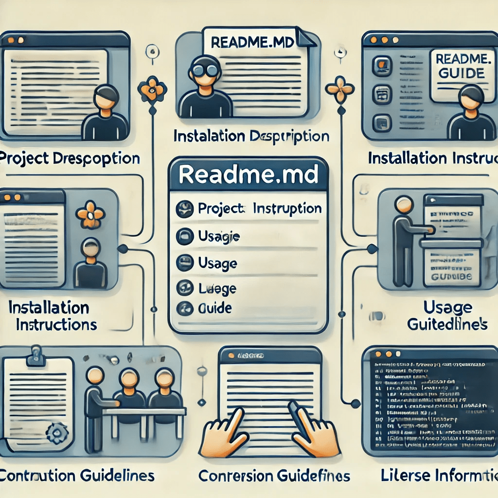

# DESKRIPSI README
README, atau baca saya, itu semacam guidebook singkat yang gunanya untuk menampilkan informasi mengenai repo yang ada di situ.

## FUNGSI FITUR README
1. Deskripsi Proyek: Penjelasan singkat tentang apa itu proyek, tujuannya, dan masalah yang ingin diselesaikan.

2. Instalasi: Langkah-langkah untuk menginstal dan menjalankan proyek di lingkungan lokal. Ini sering mencakup perintah-perintah yang diperlukan, seperti npm install, pip install, atau langkah konfigurasi lainnya.

3. Penggunaan: Petunjuk tentang cara menggunakan proyek setelah diinstal, termasuk contoh kode atau skenario penggunaan umum.

4. Kontribusi: Panduan untuk mereka yang ingin berkontribusi ke proyek, termasuk aturan penulisan kode, gaya, cara melakukan pull request, dan lain-lain.

5. Lisensi: Informasi mengenai lisensi yang digunakan dalam proyek, misalnya MIT, Apache, GPL, atau lainnya, yang menentukan hak dan batasan penggunaan kode.

## CONTOH GAMBAR KEGUNAAN README

## FOLLOW INSTAGRAM

<a href="https://www.instagram.com/cirss_">Click Here To Follow !</a>